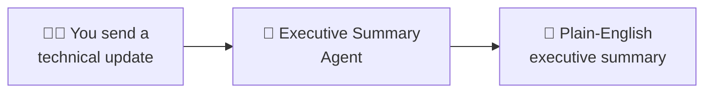

# Module 0 - Introduction

⏱️ ~10 min

> [!WARNING]
> **Preview & Limitations:** [Hosted Agents](https://learn.microsoft.com/azure/foundry/agents/concepts/hosted-agents) are currently in **public preview** — not recommended for production workloads. Be aware of the following:
> - **Supported regions are limited** — check [region availability](https://learn.microsoft.com/azure/foundry/agents/concepts/hosted-agents#region-availability) before creating resources. If you pick an unsupported region, deployment will fail.
> - The `azure-ai-agentserver-agentframework` package is pre-release — APIs may change between versions.
> - Scale limits: hosted agents support 0–5 replicas (including scale-to-zero).
> - Some features shown in this workshop may change as the service moves toward GA.

## What you'll build

In this workshop, you'll build an **"Explain Like I'm an Executive"** agent — a hosted AI agent that takes complex technical updates and rewrites them as plain-English executive summaries.

**The agent uses:**
- **Microsoft Agent Framework** — for agent logic and structure
- **Foundry Toolkit for VS Code** — to scaffold, test locally, and deploy
- **An AI model** (e.g., `gpt-4.1-mini`) — to generate the summaries

By the end of this lab, you'll have a working agent that you can test locally via the Agent Inspector, and optionally deploy to the cloud.

---

## What are hosted agents?

A **hosted agent** is an AI agent that runs as a managed service in Microsoft Foundry. Instead of managing your own infrastructure, you package your agent code in a container and Foundry handles scaling, hosting, and exposing it via a standard HTTP endpoint.

| Concept | What it means |
|---------|--------------|
| **Agent** | Your Python code that receives a user message, calls an AI model, and returns a structured response |
| **Hosted** | Foundry runs your container for you — no VMs, no Kubernetes, no infrastructure to manage |
| **Responses protocol** | A standard HTTP API (`POST /responses`) that any client can call to interact with your agent |
| **Agent Inspector** | A local testing UI (built into Foundry Toolkit) that lets you chat with your agent before deploying |

In this workshop, you'll go from zero to a fully hosted agent — or stop at local testing if you prefer.

---

## Choose your path

> ⚠️ **Pick one path before continuing.** Your choice determines which tools to install and which modules apply. You can switch from Path B → Path A later if you get a subscription.

<strong>🅰️ Path A — Azure cloud (requires Azure subscription)</strong>

| | Details |
|---|---|
| **Who is this for?** | You have an active Azure subscription and can create Foundry resources |
| **Model** | Azure OpenAI via Foundry (e.g., `gpt-4.1-mini`) |
| **Modules covered** | All modules (00–07) |
| **Deploy to cloud?** | ✅ Yes — full end-to-end deployment |

<strong>🅱️ Path B — Local / free-tier (no Azure subscription needed)</strong>

| | Details |
|---|---|
| **Who is this for?** | MVPs, students, or anyone without Azure access |
| **Model** | **Foundry Local** (free, runs on your machine) |
| **Modules covered** | Modules 00–04 (skip deploy & cloud verify) |
| **Deploy to cloud?** | ❌ No — local testing only via Agent Inspector |

---

## All paths: Required tools

Install each tool below. After installing, verify it works by running the check command.

| # | Tool | Version | Install | Verify (Expected Output) |
|---|------|---------|---------|---------------------------|
| 1 | **Visual Studio Code** | Latest | [code.visualstudio.com](https://code.visualstudio.com/) | Opens without errors |
| 2 | **Python** | 3.12 or higher| [python.org/downloads](https://www.python.org/downloads/) | `python --version` $\rightarrow$ `Python 3.12.x` |
| 3 | **Foundry Toolkit for VS Code** | Latest | Extension ID: `ms-windows-ai-studio.windows-ai-studio` | Foundry icon in Activity Bar |
| 4 | **Python extension for VS Code** | Latest | Extension ID: `ms-python.python` | Installed in Extensions panel |

> [!TIP]
> **Pro-tips for installation:**
> - **Python PATH (Windows):** Always check **"Add Python to PATH"** on the first screen of the Python installer. Without this, `python` won't be recognized in your terminal.
> - **Multiple Python versions:** If you have both Python 3.10 and 3.12 installed, use `python3.12 -m venv .venv` to ensure the correct version is used for your virtual environment.
> - **Docker WSL 2 (Windows):** During Docker Desktop installation, ensure the **WSL 2 backend** is selected. Docker with Hyper-V is slower and may cause issues with Foundry container builds.
> - **Docker not starting?** Wait 30–60 seconds after launching Docker Desktop. Run `docker info` — if you see "Cannot connect to the Docker daemon," Docker is still initializing.
> - **VS Code extensions not loading?** After installing extensions, reload the window: `Ctrl+Shift+P` → `Developer: Reload Window`.

> **Windows users:** Check **"Add Python to PATH"** during Python installation.

**Next:** [01 - Setup →](01-setup.md)
