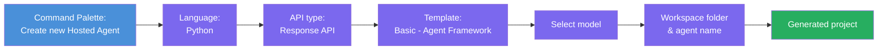

# Module 2 - Create a New Hosted Agent

⏱️ ~5 min

In this module, you use Foundry Toolkit to **scaffold a hosted agent project**. The scaffold generates the full project structure — `agent.yaml`, `main.py`, `Dockerfile`, `requirements.txt`, and VS Code debug configuration — so you can focus on customizing the agent's behavior.

> **Key concept:** The `agent/` folder in this lab is an example of what Foundry Toolkit generates. You don't write these files from scratch.

### Scaffold wizard flow



---

## Step 1: Open the Create Hosted Agent wizard

1. Press `Ctrl+Shift+P` to open the **Command Palette**.
2. Type: **Foundry Toolkit: Create new Hosted Agent** and select it.

> **Alternative: Create via Foundry Portal**
> If you prefer the browser, you can create your project at [https://ai.azure.com](https://ai.azure.com). Once the project is provisioned, return to VS Code and use the **Foundry Toolkit** sidebar to connect to it.

> **Alternative:** Click the **+** icon next to **Hosted Agents (Preview)** in the Foundry Toolkit sidebar.

## Step 2: Choose settings

1. On the left navigation/options section select the following:

| Menu | Selection | Notes |
|--------|-----------|-------|
| **Language** | Python | C# also supported |
| **Framework** | Agent Framework | Simple starting point using Agent Framework SDK |
| **API type** | Response API | `POST /responses` — conversational, with platform-managed history |
| **Template** | Basic | Simple starting point using Agent Framework SDK |

2. Once selected, click **Next**

3. In the next window, select the following:

| Menu | Selection | Notes |
|--------|-----------|-------|
| **Workspace folder** | Choose a target folder | e.g., `/workspaces/Foundry-Toolkit-MVPs-Workshop/` or a subfolder in this repo |
| **Agent name** | Enter a name | e.g., `executive-summary-agent` |
| **Environment Setup** | skip setup fot now |  |

Click **create** to create our agent. A new folder will be created with the hosted agent name.

## Step 3: Inspect the generated project

After scaffolding completes, verify you see these files in the Explorer (`Ctrl+Shift+E`):

```
📂 my-agent/
├── .env                ← Environment variables (placeholders)
├── .vscode/
│   ├── launch.json     ← Debug config (F5 → run + Agent Inspector)
│   └── tasks.json      ← VS Code task definitions
├── agent.yaml          ← Agent definition (kind: hosted)
├── Dockerfile          ← Container config for deployment
├── main.py             ← Agent entry point (your main code)
└── requirements.txt    ← Python dependencies
```

### Key files explained

| File | Purpose |
|------|---------|
| `agent.yaml` | Declares the agent as `kind: hosted`, maps environment variables, defines the `/responses` protocol |
| `main.py` | Creates a `FoundryChatClient` → wraps it in an `Agent` with instructions → serves via `ResponsesHostServer` on port 8088 |
| `Dockerfile` | Uses `python:3.12-slim`, installs dependencies, exposes port 8088, runs `main.py` |
| `requirements.txt` | `agent-framework>=1.1.0`, `agent-framework-foundry-hosting`, `debugpy` |

> **Important:** Open the scaffolded agent folder directly in VS Code (the `agent/` folder itself) so that `.vscode/launch.json` and `tasks.json` work correctly for F5 debugging.

---

### ✅ Checkpoint

- [ ] Scaffolded project created with all expected files
- [ ] `agent.yaml` shows `kind: hosted` and `protocol: responses`
- [ ] `main.py` imports `Agent`, `FoundryChatClient`, `ResponsesHostServer`
- [ ] The agent folder is open in VS Code as the workspace root

---

**Previous:** [01 - Setup](01-setup.md) · **Next:** [03 - Configure & Code →](03-configure-and-code.md)
