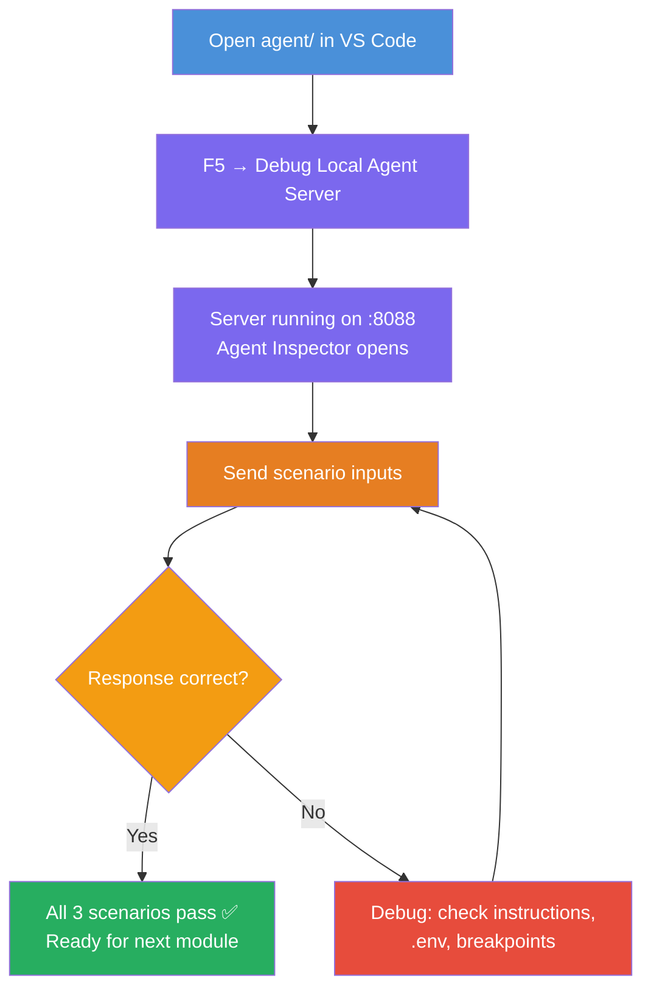

# Module 4 - Test Locally

⏱️ ~10 min

In this module, you run your agent locally and validate it works correctly using **happy-path functional tests**. You'll use the Agent Inspector (visual UI) or direct HTTP calls to confirm the agent produces structured, accurate responses.

### Local testing flow



---

## Option 1: Press F5 — Debug with Agent Inspector (recommended)

### Start the debugger

1. Open the **executive-summary-agent/** folder directly in VS Code (`File → Open Folder`).
2. Open the **Run and Debug** panel (`Ctrl+Shift+D`).
3. Select **Debug Local Agent Server** from the dropdown.
4. Press **F5** (or click ▶ Start Debugging).

> ⚠️ **Critical: Select your Python Interpreter**
> If you get "ModuleNotFoundError" or the debugger fails to start, you must tell VS Code to use your virtual environment:
> 1. Press `Ctrl+Shift+P` $\rightarrow$ type **Python: Select Interpreter**.
> 2. Select the interpreter located in your project's `.venv` folder (e.g., `.\.venv\Scripts\python.exe` on Windows).
> 3. Restart the debug session.

### What happens

1. The HTTP server starts on `http://localhost:8088/responses`.
2. The **Agent Inspector** panel opens automatically — a visual chat interface for testing.
3. Breakpoints are enabled in `main.py`.

Watch the Terminal for:
```
Starting executive summary hosted agent
Executive agent server running on http://localhost:8088
```

> **If the Agent Inspector doesn't open:** Press `Ctrl+Shift+P` → **Foundry Toolkit: Open Agent Inspector**.


> *Screenshot may show older 'AI TOOLKIT' branding from an earlier extension version.*

---

## Option 2: Test via Terminal (alternative)

Start the agent in one terminal, send requests from another:

```bash
# Terminal 1: Start agent
cd executive-summary-agent/
source .venv/bin/activate
python main.py
```

```bash
# Terminal 2: Send test (curl)
curl -sS -X POST http://localhost:8088/responses \
  -H "Content-Type: application/json" \
  -d '{"input": "The API latency increased due to thread pool exhaustion caused by sync calls in v3.2.", "stream": false}'
```

---

## Scenario tests: Happy-path functional validation

Run **all three** scenarios below. These validate that your agent produces correct, structured output for realistic inputs.


### Scenario 1: IT Incident — API latency spike

**Input:**
```
The API latency increased from 200ms to 2s after deploying v3.2.
Root cause: thread pool starvation from synchronous calls in /orders.
Rolled back at 10:14.
```

**Expected behavior:**
- ✅ Follows the "Executive Summary" structure (What happened / Business impact / Next step)
- ✅ No technical jargon (no "thread pool", no "/orders", no "v3.2")
- ✅ Clearly states business impact (e.g., users experienced delays)
- ✅ Includes a next step (e.g., fix deployed, monitoring in place)

---

### Scenario 2: Data Pipeline — ETL failure

**Input:**
```
The nightly ETL job failed because the upstream schema changed. APAC dashboards show missing data.
```

**Expected behavior:**
- ✅ Summarizes the data refresh failure in plain language
- ✅ Mentions the APAC dashboard impact
- ✅ Includes a remediation next step
- ✅ Does NOT mention "ETL", "schema", or other technical terms

---

### Scenario 3: Security — Exposed credential

**Input:**
```
Static analysis flagged a hardcoded secret in the repository.
The secret may have been exposed in commit history.
```

**Expected behavior:**
- ✅ Describes a credential/security issue in executive-friendly language
- ✅ Calls out potential risk (unauthorized access)
- ✅ States remediation action (credential rotation, audit)
- ✅ Does NOT include terms like "static analysis", "commit history", or "hardcoded"

---

## Validation criteria

For each scenario, check:

| # | Criteria | Pass condition |
|---|----------|---------------|
| 1 | **Structure** | Response uses "Executive Summary" format with all three bullets |
| 2 | **Plain language** | No technical jargon that an executive wouldn't understand |
| 3 | **Accuracy** | Summary reflects the input — no fabricated details |
| 4 | **Brevity** | Response is under 100 words |
| 5 | **Next step** | A clear action or mitigation is stated |

---

## Debugging tips

| Issue | Fix |
|-------|-----|
| Agent doesn't start | Check `.env` values, verify venv is activated, run `pip install -r requirements.txt` |
| Empty or generic response | Review instructions in `main.py` — ensure output format is specified |
| Response includes jargon | Strengthen "remove technical terms" rules in instructions |
| Agent Inspector doesn't open | `Ctrl+Shift+P` → **Foundry Toolkit: Open Agent Inspector** |
| Model errors in Terminal | Verify `MODEL_DEPLOYMENT_NAME` matches exactly (case-sensitive) |

---

### ✅ Checkpoint

- [ ] Agent starts locally without errors
- [ ] Agent Inspector opens and shows a chat interface (if using F5)
- [ ] **Scenario 1** (IT incident) — structured Executive Summary, no jargon
- [ ] **Scenario 2** (data pipeline) — relevant summary with business impact
- [ ] **Scenario 3** (security alert) — appropriate risk communication
- [ ] All responses follow the defined output structure

> **Save your responses** (copy or screenshot) — you'll compare them with cloud results in Module 06.

---

**Previous:** [03 - Configure & Code](03-configure-and-code.md) · **Next:** [05 - Deploy to Foundry →](05-deploy-to-foundry.md)
