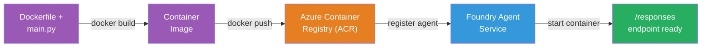
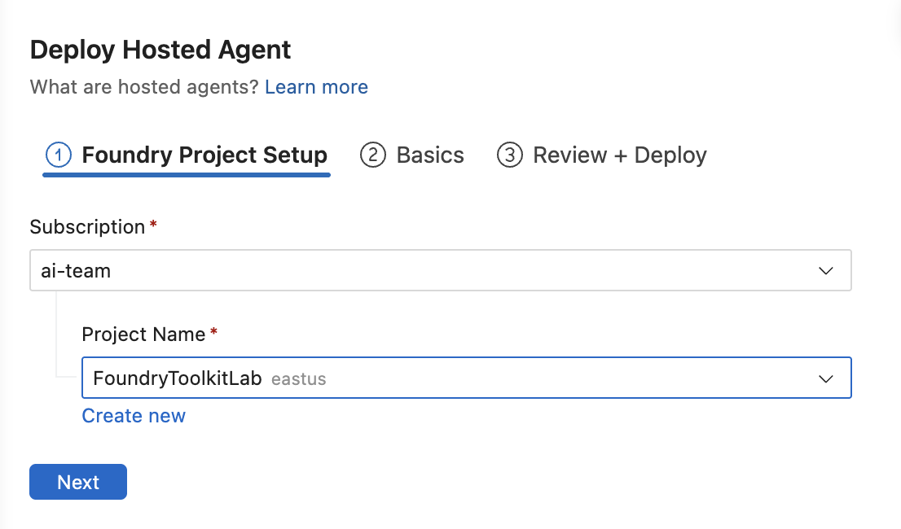
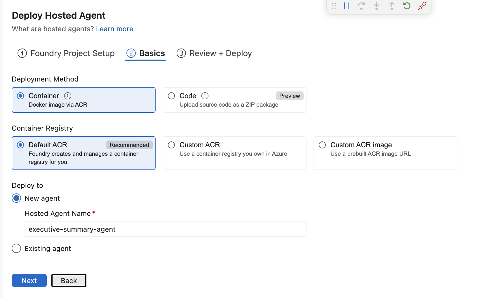
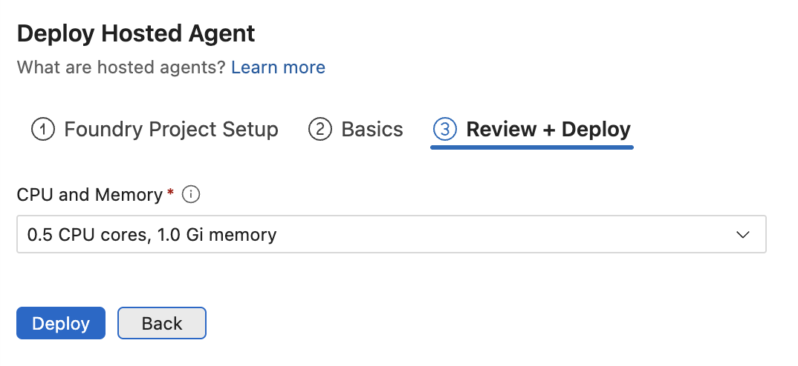
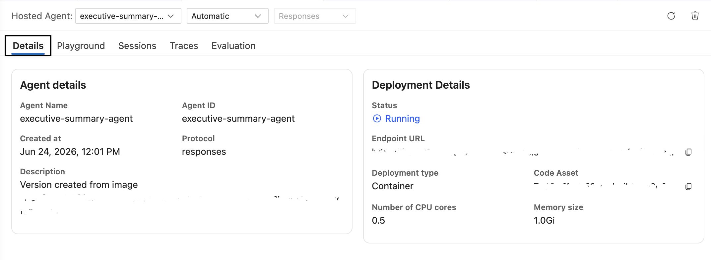

# Module 5 - Deploy to Foundry Agent Service

⏱️ ~10 min

> ⚠️ **Path B users:** This module requires a Foundry subscription. If you're using Foundry Local, skip to [Module 07 — Summary](07-summary.md). You've successfully completed the local development workflow!

In this module, you deploy your locally-tested agent to Microsoft Foundry as a **Hosted Agent**. The deployment builds a container image, pushes it to Azure Container Registry, and starts the agent in Foundry's managed infrastructure.

### Deployment pipeline

---

## Prerequisites check

Before deploying, verify:

- [ ] Agent passes all 3 local scenarios from [Module 04](04-test-locally.md)
- [ ] You have the **Azure AI User** role at the project level ([Module 01, Assign RBAC](01-setup.md#deploy-a-model--assign-rbac))
- [ ] You're signed into Azure in VS Code (Accounts icon shows your name)

---

## Step 1: Start the deployment

### Option A: Deploy from Agent Inspector (recommended)

If the Agent Inspector is open (from testing):
1. Click the **Deploy** button in the top-right corner (cloud icon ↑).

### Option B: Deploy from Command Palette

1. Press `Ctrl+Shift+P` → **Foundry Toolkit: Deploy Hosted Agent**.

---

## Step 2: Configure the deployment

The wizard prompts you for:

| Prompt | Selection |
|--------|-----------|
| **Subscription** | Your Azure Subscription |
| **Target project** | Your Foundry project (e.g., `workshop-agents`) |

Click **next** to configure your agent.

| Prompt | Selection |
|--------|-----------|
| **Deployment Method** | Container |
| **Container registry** | **Default ACR** (Microsoft Foundry creates and manages one for you) |
| **Deploy to** | New Agent (name, `executive-summary-agent`) |

Click **next** to review and deploy your agent.

| Prompt | Selection |
|--------|-----------|
| **CPU and memory** | **0.25 CPU cores, 0.5 Gi memory** (sufficient for workshop) |

---

## Step 3: Deploy and monitor

1. Click **Deploy**.
2. Watch the **Output** panel (select **Microsoft Foundry** from the dropdown).
3. The deployment runs through these stages:
   - **Docker build** — builds container from your Dockerfile
   - **Docker push** — pushes image to ACR (1–3 min on first deploy)
   - **Agent registration** — creates hosted agent in Foundry
   - **Container start** — starts with system-managed identity

4. When complete, a notification appears:
   > **my-agent is deployed successfully.** `View logs` `Run agent`

5. Click **Run agent** to open the Agent Playground.

### Deployment status values

| Status | Meaning |
|--------|---------|
| **Running** | Container ready, agent responding |
| **Pending** | Container starting — wait 30–60 seconds |
| **Failed** | Check logs (see troubleshooting below) |

---

## Common deployment errors

| Error | Root cause | Fix |
|-------|-----------|-----|
| `agents/write` permission denied | Missing **Azure AI User** role at project level | [Module 01, Assign RBAC](01-setup.md#deploy-a-model--assign-rbac) |
| Docker not running | Docker Desktop not started | Start Docker Desktop → verify `docker info` |
| ACR authorization | Managed identity can't pull image | See [Module 08 — Troubleshooting](08-troubleshooting.md) |

---

### ✅ Checkpoint

- [ ] Deployment completed without errors
- [ ] Agent appears under **Hosted Agents (Preview)** in the Foundry sidebar
- [ ] Container status shows **Running**
- [ ] Agent Playground tab opened showing agent details and endpoint URL

---

**Previous:** [04 - Test Locally](04-test-locally.md) · **Next:** [06 - Verify in Playground →](06-verify-in-playground.md)
